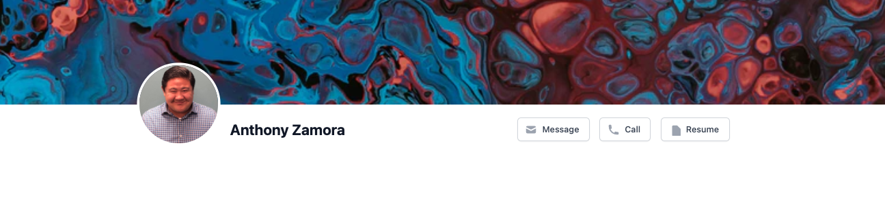
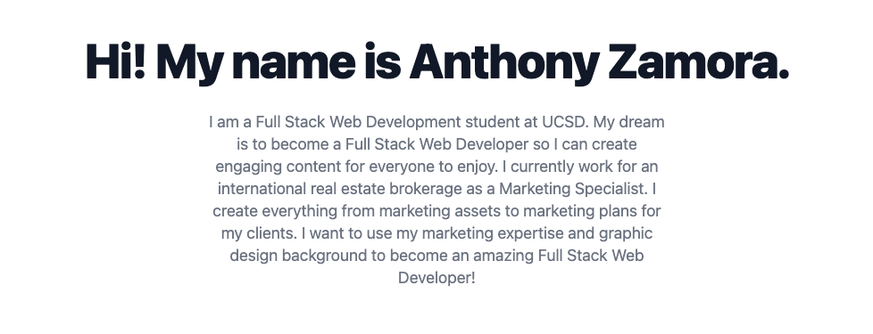
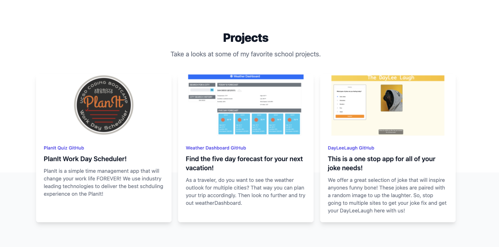
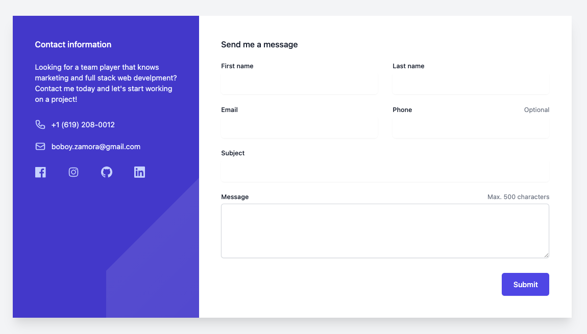
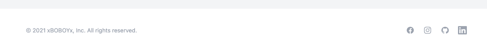

## Anthony Zamora Portfolio 

Welcome to my portfolio page! This is a work in progress. I will continue to add to this as I learn more in class. I decided to dedicate focus on using Tailwinds CSS. This seems like a good CSS framework to work with for the remainder of the bootcamp and beyond.

## Technologies Used

- HTML5
- CSS
- Tailwinds CSS Framework

## Here are a few screenshots of my Portfolio

## Check out the deployed Portfolio

## [Portfolio](https://xboboyx.github.io/Portfolio/)

### Contact Me

#### Email - boboy.zamora@gmail.com
